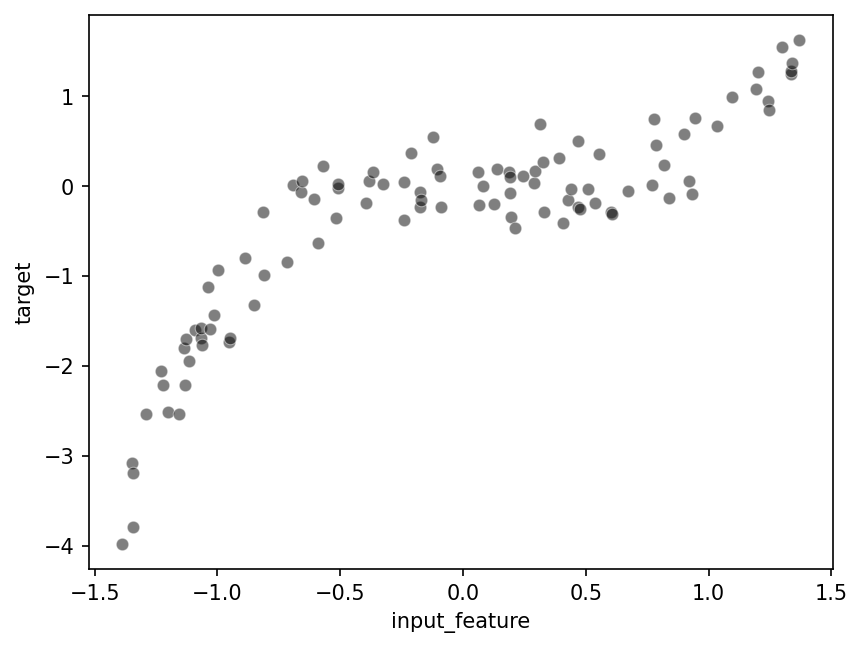
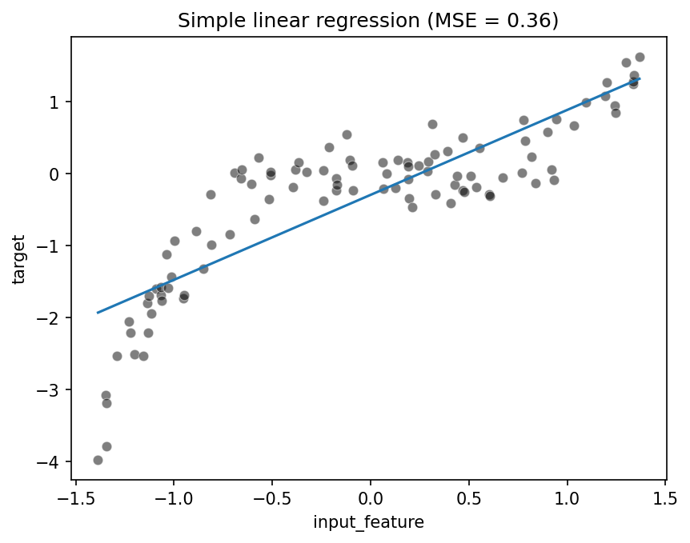
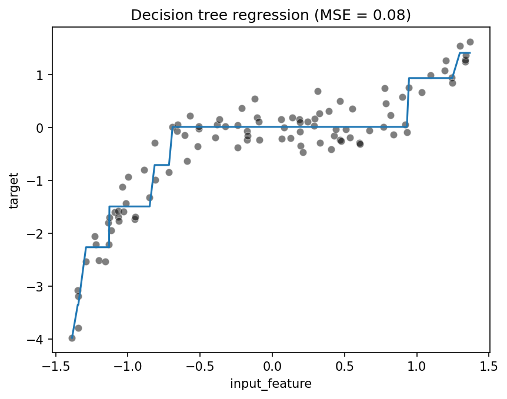
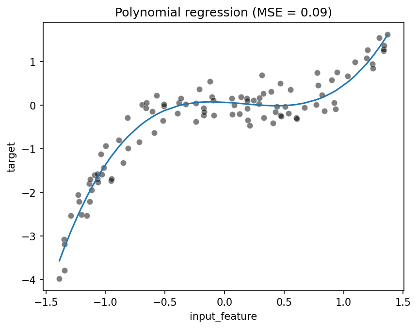
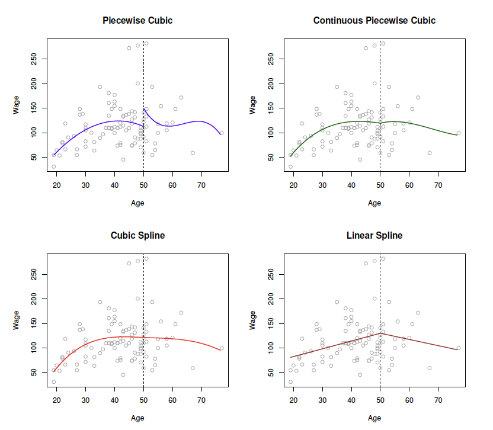
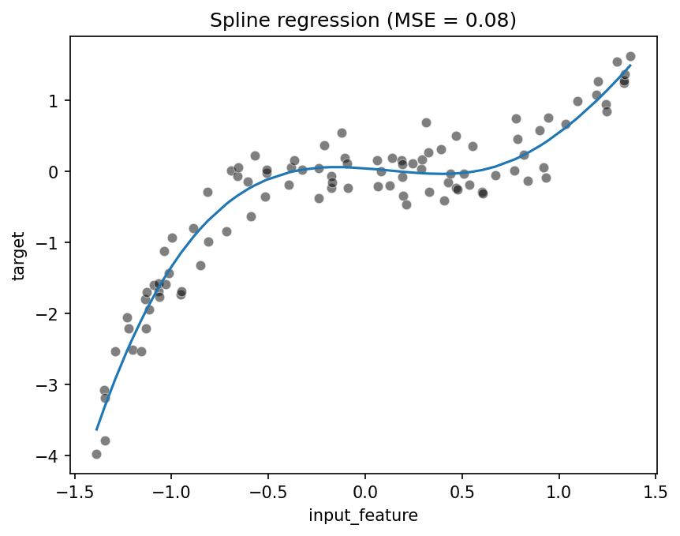

## Learning Objectives

In this lecture we learn to:

1. Distinguish between linear and non-linear relationships.
2. Fit non-linear patterns using non-linear models.
3. Fit non-linear patterns using linear models with `PolynomialFeatures`.
4. Fit non-linear patterns using linear models with `SplineTransformer`.
5. Recognize Decision Trees and Support Vector Machines as non-linear models.

:::: {.notes}
The theme: even when the data shows curved patterns, we can still leverage linear models by engineering non-linear features, and we can also turn to inherently non-linear models.
::::

---

## A synthetic non-linear dataset

- We generate a **1D input feature** and a **non-linear target**:
  - Target is roughly a **cubic polynomial** in the input.
  - We add some **random noise** to make it realistic.
- We store the data in a pandas DataFrame with:
  - `input_feature`
  - `target`

:::: {.notes}
This controlled setup lets us know the ground-truth relationship (cubic) while still having randomness. It’s ideal for illustrating underfitting and improved models.
::::

---

## Visualizing the non-linear pattern

:::: {.columns}

::: {.column width="60%"}
- Scatter plot of `input_feature` vs `target` shows:
  - A **curved** trend, not a straight line.
  - Local regions where the slope changes sign.
:::

::: {.column width="40%"}

:::

::::

:::: {.notes}
Encourage students to inspect the shape: a straight line will clearly miss some structure. This motivates feature engineering or non-linear models.
::::

---

## Plain LinearRegression underfits

:::: {.columns}

::: {.column width="60%"}
- If we fit a standard `LinearRegression` on this data:
  - The model learns a **single straight line**.
  - The line will miss the **cubic curvature**.
  - Error (e.g. MSE) remains relatively **high**.
:::

::: {.column width="40%"}

:::

::::

:::: {.notes}
Connect to the notion of **underfitting**: the model is too simple to capture the structure, even with perfect training. More data alone won’t fix a fundamentally mismatched model.
::::

---

## Strategy 1: Non-linear models

:::: {.columns}

::: {.column width="60%"}
- One solution is to use **non-linear estimators** directly:
  - **Decision Trees**
  - **Random Forests**
  - **Support Vector Machines (SVMs)** with non-linear kernels
- These models can represent **curved decision boundaries** or non-linear regression functions.
:::

::: {.column width="40%"}

:::

::::

:::: {.notes}
At this stage, keep the description high-level. The key idea is that some models are non-linear “by design” and can adapt flexibly to complex patterns.
::::

---

## Strategy 2: Non-linear feature engineering

- Another strategy: **keep the linear model**, but **transform the features**.
- We create new features from the original input, e.g.:
  - Powers: \( x^2, x^3, \dots \)
  - Piecewise basis functions (splines).
- Then we fit a **linear model** on these **engineered features**.

:::: {.notes}
Emphasize that a linear model on non-linear features can approximate curved functions. The model is still linear in the **parameters**, but non-linear in the **original input**.
::::

---

## PolynomialFeatures + LinearRegression

- We use `PolynomialFeatures` to build powers of the input:

```python
from sklearn.preprocessing import PolynomialFeatures
from sklearn.linear_model import LinearRegression

poly = PolynomialFeatures(degree=3, include_bias=False)
X_poly = poly.fit_transform(data)  # data is 2D: (n_samples, 1)

reg = LinearRegression()
reg.fit(X_poly, target)
```

- The model can now fit **cubic-like curves**.

:::: {.notes}
Connect degree 3 explicitly to the underlying cubic relationship in the synthetic data. Point out that higher degrees give more flexibility but increase the risk of overfitting.
::::

---

## Visual effect of polynomial features

:::: {.columns}

::: {.column width="60%"}
- After transformation, the linear model’s prediction:
  - Curves to follow the data trend.
  - Achieves **lower MSE** than the plain line.
- We can compare fits for different degrees (e.g. 1, 3, 10):
  - Degree 1: underfitting.
  - Moderate degree: good fit.
  - Very high degree: risk of **overfitting** (wiggly curve).
:::

::: {.column width="40%"}

:::

::::

:::: {.notes}
Use side-by-side plots (or a sweep over degrees) to visually show underfitting vs overfitting. Reinforce the bias–variance trade-off.
::::

---

## Splines: localized flexibility


:::: {.columns}

::: {.column width="60%"}
- `SplineTransformer` builds **piecewise polynomial** features:
  - The feature space is split into regions (“knots”).
  - In each region, we fit a low-degree polynomial.
  - The pieces are joined **smoothly** at the knots.

```python
from sklearn.preprocessing import SplineTransformer
from sklearn.pipeline import make_pipeline
from sklearn.linear_model import LinearRegression

model = make_pipeline(
    SplineTransformer(n_knots=..., degree=3),
    LinearRegression(),
)
model.fit(data, target)
```

:::

::: {.column width="40%"}

:::

::::


:::: {.notes}
Explain that splines give more local control than a single global polynomial. We can capture curves that bend differently in different parts of the input range.
::::

---

## Comparing polynomial and spline approaches

:::: {.columns}

::: {.column width="60%"}
- **PolynomialFeatures:**
  - Global polynomial; behavior at one end affects the whole curve.
  - Simpler to understand, but can behave wildly outside the data range.
- **SplineTransformer:**
  - Local control; can adapt shape in different regions.
  - Often more stable and interpretable for complex curves.
:::

::: {.column width="40%"}

:::

::::

:::: {.notes}
Encourage students to see both as feature engineering tools. Choice depends on problem, data range, and how much local flexibility is needed.
::::

---

## Other non-linear models (overview)

- **Decision Trees:**
  - Split the feature space into regions with simple predictions.
  - Naturally non-linear and easy to visualize.
- **Random Forests / Gradient Boosting:**
  - Ensembles of trees for stronger performance.
- **Support Vector Machines (SVMs):**
  - With non-linear kernels (e.g. RBF), can learn complex boundaries.

:::: {.notes}
This slide is a preview, not a deep dive. The goal is to position non-linear feature engineering alongside inherently non-linear estimators in the ML toolbox.
::::

---

## Take-home messages

- Not all data is **linearly** related; curved patterns are common.
- We can address non-linearity in two main ways:
  - Use **non-linear models** (trees, SVMs, etc.).
  - Use **non-linear feature engineering** (polynomials, splines) with linear models.
- `PolynomialFeatures` and `SplineTransformer`:
  - Expand a single input into richer feature sets.
  - Let linear regression approximate complex functions.

:::: {.notes}
Close by tying back to linear models as a flexible building block: combined with the right features, they can handle surprisingly rich patterns while remaining relatively simple.
::::

