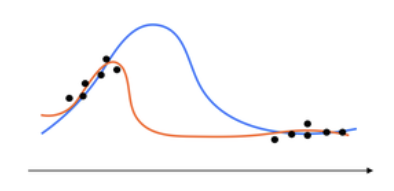
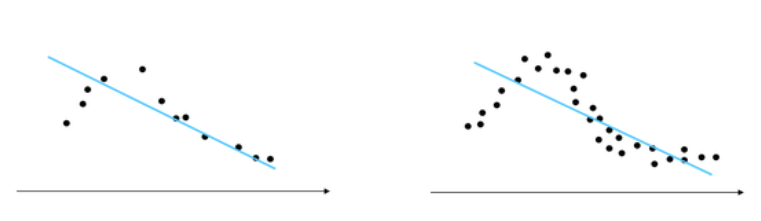
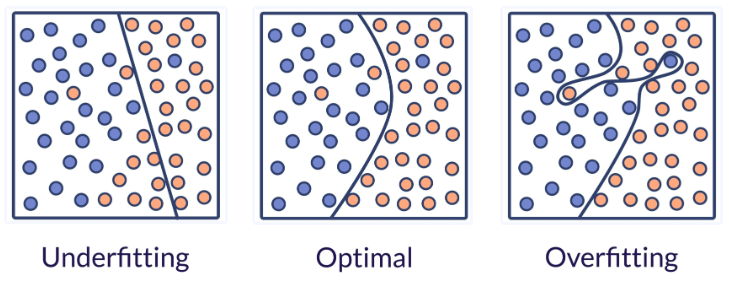
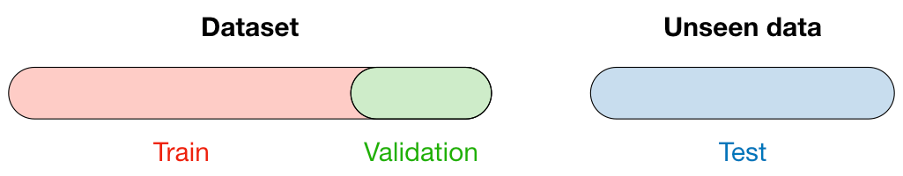
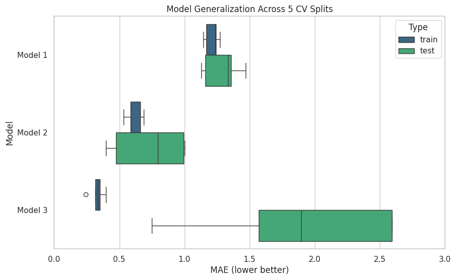
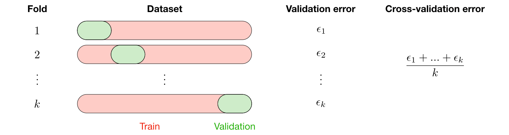

## Loss Function vs Evaluation Metric

The question is: how to evaluate the model's performance?

**Loss** (lower is better): is the internal objective function being minimized by the selected machine learning algorithm during training. Examples:

- Mean Squared Error (MSE) for `LinearRegression`
- Log Loss for `LogisticRegression`
- Entropy for `DecisionTreeClassifier`

**Metrics**: are used to evaluate the model's performance from a practical or business perspective. They are not used to "train" the model; rather, to judge it's performance and compare it against other models. Examples:

- [**Regression Metrics**](../../M2/lessons/06_regression_metrics.ipynb) (where targets are **continuous**):
    - R-squared (default when you call `model.score()`) 
    - Mean Squared Error (MSE) - (also used as a loss function)
    - Mean Absolute Percentage Error (MAPE)
- [**Classification Metrics**](../../M4/lessons/01_classification_metrics.ipynb) (where targets are **categorical**):
    - Accuracy (default when you call `model.score()`) 
    - Precision
    - Recall

If you are wondering, can we use a metric as a loss function? The math says: only if the function is differentiable.

What about using the loss as a metric? Humans say: if they are easily translatable to our business problem. (more on this later).


## How to verify the model is learning?

We can answer by saying: **it should at least be better than a guess, let alone a random prediction**.

When doing supervised learning, a simple sanity check consists of comparing one’s estimator against simple rules of thumb. [`DummyClassifier`](https://scikit-learn.org/stable/modules/generated/sklearn.dummy.DummyClassifier.html#sklearn.dummy.DummyClassifier "sklearn.dummy.DummyClassifier") implements several such simple strategies for classification:

- `constant` always predicts a constant label that is provided by the user.
- `most_frequent` always predicts the most frequent label in the training set.
- `stratified` generates random predictions by respecting the training set class distribution (e.g., 20% of class A, 80% of class B).

Note that with all these strategies, the `predict` method completely ignores the input data!

To illustrate [`DummyClassifier`](https://scikit-learn.org/stable/modules/generated/sklearn.dummy.DummyClassifier.html#sklearn.dummy.DummyClassifier "sklearn.dummy.DummyClassifier"), first let’s create an imbalanced dataset:

```python
from sklearn.dummy import DummyClassifier

dummy_clf = DummyClassifier(strategy="most_frequent")
dummy_clf.fit(X_train, y_train)
```

Next, let’s compare the accuracy of `LogisticRegression` and `most_frequent`:

```python
print('Dummy Classifier Score:', dummy_clf.score(X_test, y_test))
print('Logistic Regressino Score:', clf.score(X_test, y_test))
```

More generally, when the accuracy of a classifier is too close to random, it probably means that something went wrong: features are not helpful, a hyperparameter is not correctly tuned, the classifier is suffering from class imbalance, etc…

[`DummyRegressor`](https://scikit-learn.org/stable/modules/generated/sklearn.dummy.DummyRegressor.html#sklearn.dummy.DummyRegressor "sklearn.dummy.DummyRegressor") also implements four simple rules of thumb for regression:

- `mean` always predicts the mean of the training targets.
- `median` always predicts the median of the training targets.
- `quantile` always predicts a user provided quantile of the training targets.
- `constant` always predicts a constant value that is provided by the user.

In all these strategies,  the `predict` method completely ignores the input data.


## What does "more" data mean for a model?

Generally speaking, yes, given that a few conditions are met:

**It fills gaps:** New data must cover areas where the model actually lacks information. Piling on more examples of what it already understands (orange) won't improve it. In the example below, you’re not going to see much improvement if you keep adding data to the tails (and ignoring the middle area).



**The model is capable:** The mathematical tool must be complex enough to match the actual pattern. A basic straight-line model will never learn a curve, regardless of how much data you feed it. In the example below, adding more data will not improve accuracy since we’re attempting to model a nonlinear phenomenon with the wrong tool - linear regression.



**Correctness**: Beware of “Garbage in - garbage out.” Do not compromise data quality just so that you have a larger dataset. Trading quality for quantity is never a winning bet in machine learning.

[Original Post on Quora](https://qr.ae/pKkdtC).


## Model scalability: can the model learn from more data?

**Learning curves** show the effect of adding more training samples.


::: {.columns}
::: {.column}
Left: naive Bayes classifier. Its shape can be found in more complex datasets very often:

- the training score is very high when using few samples for training and decreases when increasing the number of samples
- whereas the test score is very low at the beginning and then increases when adding samples.
- the training and test scores become more realistic when all the samples are used for training.

:::
::: {.column}
Right: SVM classifier with RBF kernel.

- The training score remains high regardless of the size of the training set.
- On the other hand, the test score increases with the size of the training dataset.
- Indeed, it increases up to a point where it reaches a plateau.

:::
:::


Observing such a *plateau* is an indication that **it might not be useful to acquire new data to train the model** since the generalization performance of the model will not increase anymore.

Read more: [Plotting Learning Curves and Checking Models’ Scalability](https://scikit-learn.org/stable/auto_examples/model_selection/plot_learning_curve.html).

## Over-fitting and Under-fitting

Both Regression and Classification models can under-fit, over-fit, or fit just right.

Here is how this looks like for Classification models:



Here is how it looks for Regression models:


[See Code](https://scikit-learn.org/stable/auto_examples/model_selection/plot_underfitting_overfitting.html).

Of course, this is simplified for visualization. In practice, we need to quantify this with numbers to estimate the performance for more-than-visually-possible amount of features.

## Generalization

**Generalization**: The extent to which a model fits data it hasn't seen during training. It is quantified using an error metric.

A model suffers from error coming from two conflicting sources: **Bias** and **Variance**.

**Bias**: This is the average estimation error on the training data. It occurs when a model is too simple to capture the underlying patterns in the data, either due to having too few parameters or a weak structure. This phenomenon is called **Under-fitting**.

**Variance**: This refers to the fluctuation in the model's error when evaluated on different unseen datasets. It happens when a model is too detailed (has too many parameters), when there is insufficient data (the data fails to express the general pattern), or both. This is called **Over-fitting**.

The **Good-fit** model strikes a balance between the two:

- The model: Has enough capacity for detail to capture small patterns, and enough abstraction to capture the big picture.
- The data: Adequately represents both small and large patterns.

### Evaluating Generalization Performance

Question: how to estimate generalization performance of a model?

When selecting a model, we distinguish 3 different parts of the data that we have as follows:

- **Training set**: Fit parameters
- **Validation set**: Evaluate intermediate models to select the best one
- **Testing set**: Final unbiased performance check

These are represented in the figure below:



Once the model has been chosen (using training and validation sets); they are grouped together again and the selected model is then trained on the entire train-validation set. Finally, it is tested on the never-seen test set.

::: {.callout-warning}

If you use the Testing Set to make decisions about which model is "better," you have effectively turned your test set into a validation set. So, never let the model develop based on any information about the test set.

:::

### Cross-validation estimates

When doing a single train-test split we don't give any indication regarding the robustness of the evaluation of our predictive model: in particular, **if the test set is small**, this estimate of the testing error will be unstable and wouldn't reflect the "true error rate" we would have observed with the same model on an unlimited amount of test data.

For instance, we could have been **lucky when we did our random split of our limited dataset** and isolated some of the easiest cases to predict in the testing set just by chance: the estimation of the testing error would be overly optimistic, in this case.

To make our scoring more reliable we use **Cross-validation (CV)** which works with two loops:

- **Loop**: set hyperparameters; the structural settings you chose before training begins, like the degree of the polynomial
  - **Fitting**: the model uses the Training Set to adjust its internal parameters, like the coefficients and intercept in linear regression
  - Test performance on the *Validation set* (so far it is unseen)

By repeating the splitting procedure, and averaging the results, CV achieves a more reliable estimate of whether the model is over-fitting, under-fitting, or generalizing well.

The following figure shows a generalization performance of a 3 different models, each across 5 CV splits:




### Cross-validation strategies

There are [different cross-validation strategies](https://scikit-learn.org/stable/modules/cross_validation.html#cross-validation-iterators), two of which are summed up in the table below:

| **k-fold**                                                                                     | **Leave-p-out**                                                                                                      |
| ---------------------------------------------------------------------------------------------- | -------------------------------------------------------------------------------------------------------------------- |
| • Training on $k−1$ folds and assessment on the remaining one  <br>• Generally $k=5$ or $k=10$ | • Training on $n−p$ observations and assessment on the $p$ remaining ones  <br>• Case $p=1$ is called "leave-one-out" |

The most commonly used method is called $k$-fold cross-validation and splits the training data into $k$ folds to validate the model on one fold while training the model on the $k−1$ other folds, all of this $k$ times. The error is then averaged over the $k$ folds and is named **cross-validation error**.

.

::: {.callout-note}

**A test set should still be held out for a final evaluation**.

:::

The technique is explained in more details in the following lab.

### Cross-validation for Time-series data

In time-series data, the order of the data is important. So, we need to use a cross-validation strategy that preserves the order of the data. One such strategy is called `TimeSeriesSplit`.

Refer to [this section](https://scikit-learn.org/stable/modules/cross_validation.html#cross-validation-of-time-series-data) for more details.

Then, to make use of the full dataset (especially in time-series predictions where recency it crucial); a final training on the entire dataset (including the test) is often done. But, no further testing is done after that. Instead, we report the number we got from the previous test.
