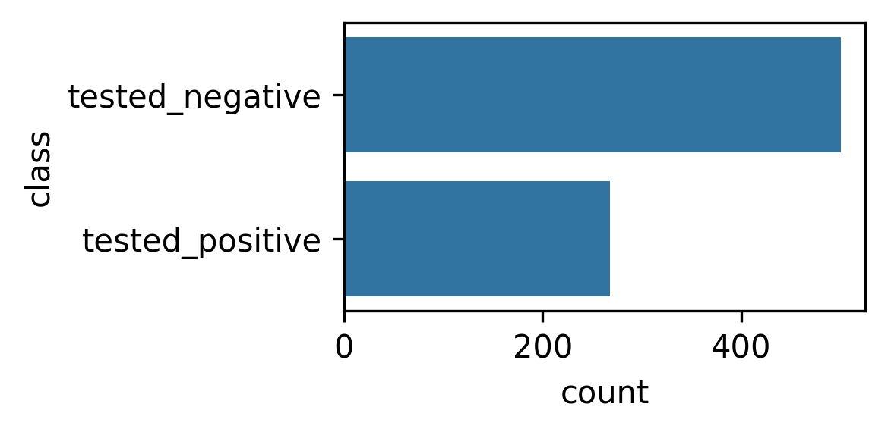
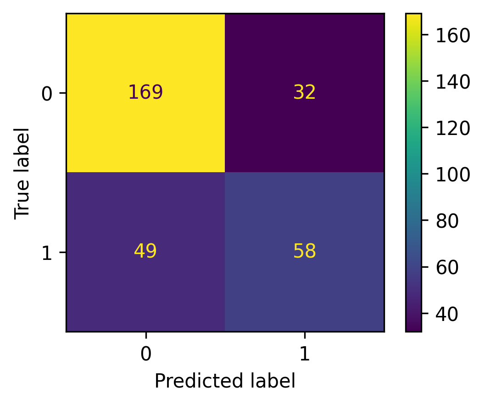
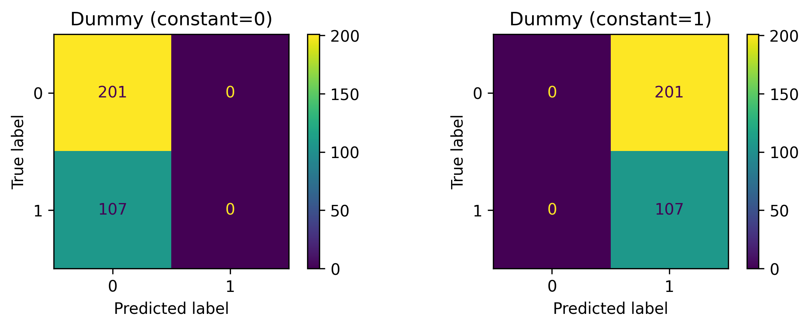
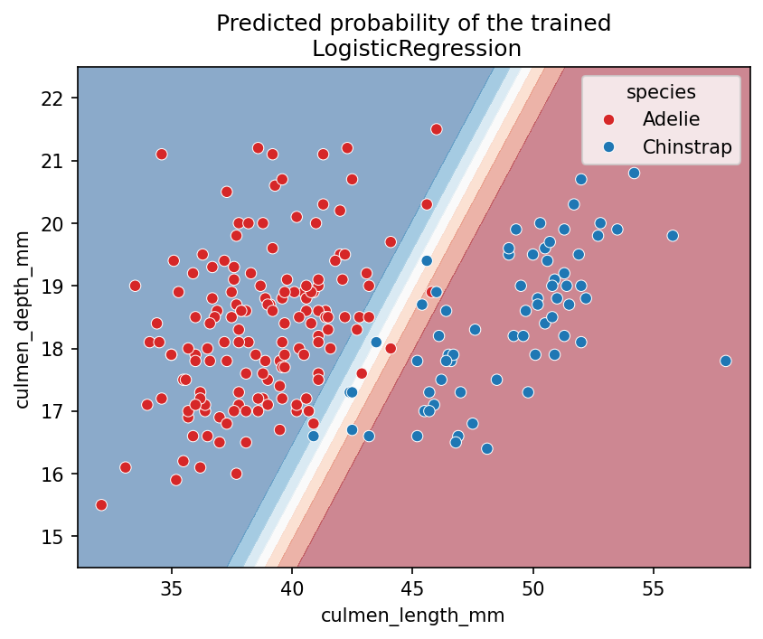
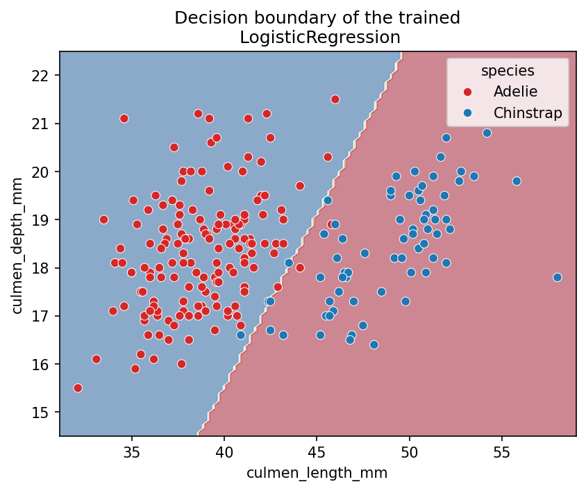
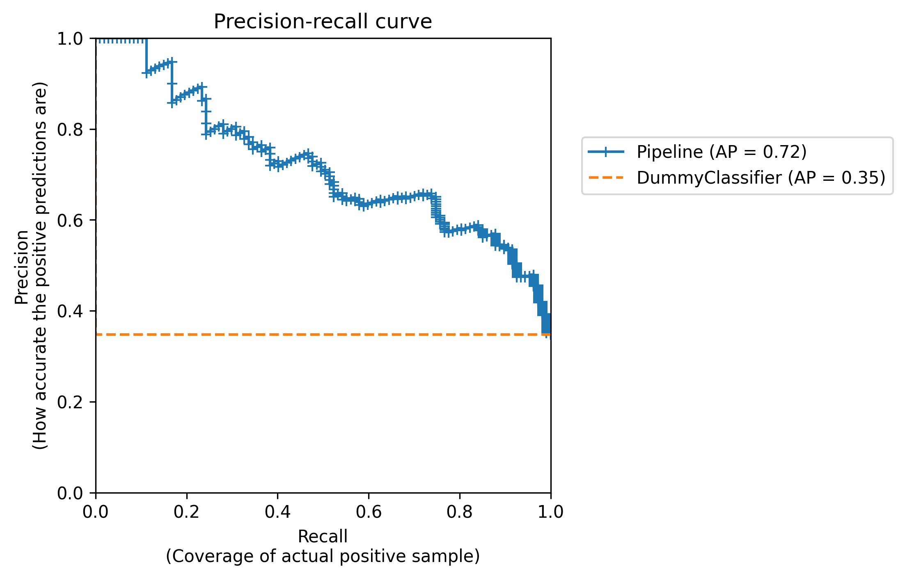
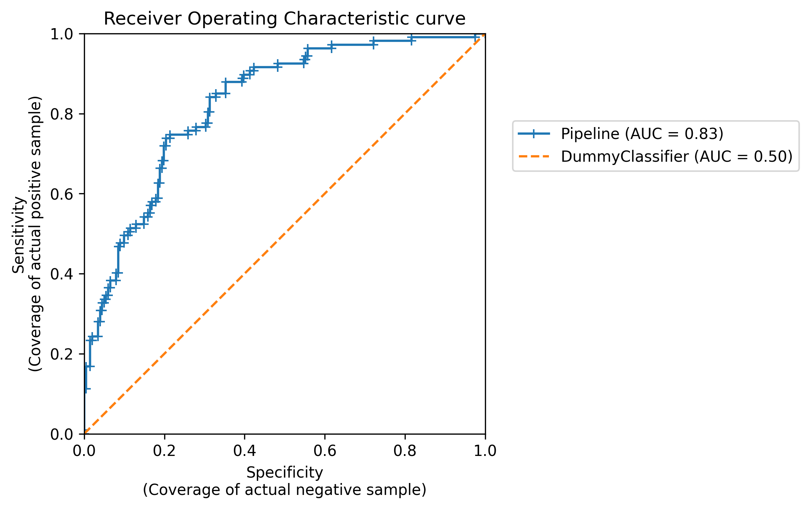
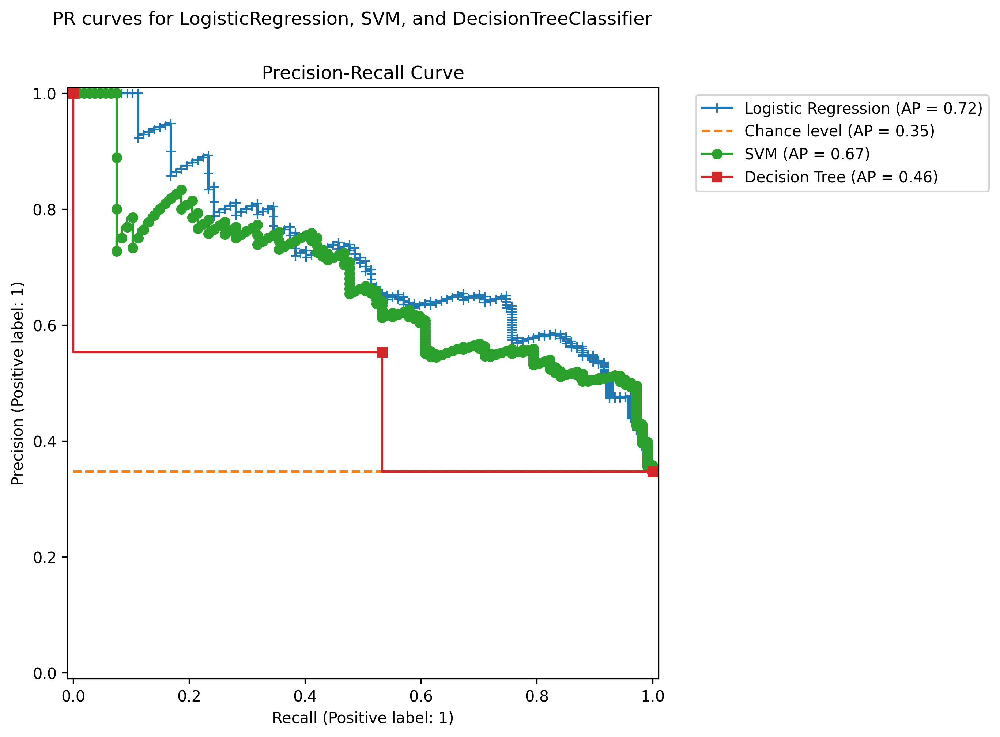

## Learning Objectives

In this lecture we learn to:

1. Distinguish classification metrics by how they trade off `FP` vs `FN`
2. Interpret performance from a confusion matrix
3. Compare classifiers using PR curves and ROC curves
4. Select the “best” classifier based on the metric that matches the use-case

::::: {.notes}
Focus on the mindset: metrics are the bridge between model predictions and the real-world costs of errors.
::::

---

## Why Metrics Matter

- If you can measure it, you can improve it.
- Metrics help capture a business goal into a quantitative target.
- Metrics quantify the “gap” between:
  - a guessing model
  - a perfect model
  - progress over time
- Different metrics imply different trade-offs, so they encode what you value.

---

## Accuracy as a Baseline

- **Accuracy** is the fraction of correct predictions.
- Accuracy can look good even when the model fails at the rare class.

::::: {.notes}
Use accuracy as a sanity check, not as the only decision rule.
::::

---

## How good is `74%`?

Let's compare against a `DummyClassifier`:

- DummyClassifier: `65.25%`
- LogisticRegression: `73.70%`
- Difference: `+8.4%`

Is accuracy a good metric for imbalanced data? No.

## Point Metrics: Confusion Matrix

:::: {.columns}
:::: {.column width="40%"}
Confusion matrices organize predictions into error types:

- **False Positives (FP):** Predicted positive, actually negative 
- **False Negatives (FN):** Predicted negative, actually positive  

All possible outcomes:

- `TP` (True Positives)
- `TN` (True Negatives)
- `FP` (False Positives)
- `FN` (False Negatives)
::::

:::: {.column width="60%"}

::::
::::

---

## Point Metrics Summary

Common metrics derived from `TP`, `TN`, `FP`, `FN`:

- **Accuracy:** `(TP + TN) / (TP + TN + FP + FN)`
- **Precision:** `TP / (TP + FP)`  
  Precision answers: “Of the predicted positives, how many were correct?”
- **Recall (Sensitivity):** `TP / (TP + FN)`  
  Recall answers: “Of the actual positives, how many did we find?”
- **Specificity:** `TN / (TN + FP)`
- **F1 score:** `2TP / (2TP + FP + FN)` (hybrid when you need both)

::::: {.notes}
Precision-recall trade-off is not an accident; it is controlled by the decision rule (threshold).
::::

## Confusion Matrix: Dummy Classifiers

---

## Thresholding after: Probability and Distance

A binary classifier produces a continuous value first, and `predict()` turns that number into a class using a threshold:

1. `predict_proba()` thresholds a **Probability**:
   - positive if `P(positive) > 0.5`
2. `decision_function()` thresholds a **Distance** from the boundary:
   - positive if `score > 0.0`

So `predict()` is the final “gate” that decides what errors you make.

[Demo: Classifier Threshold effect on point and summary metrics](./widget_threshold.qmd).

---

## Probability Near the Decision Boundary

:::: {.columns}
:::: {.column width="40%"}
- Logistic regression outputs probabilities (not hard labels) for each input.
- Near the decision boundary, probabilities are close to `0.5` (high uncertainty).
- Far from the boundary, probabilities are closer to `0` or `1` (more confident).
::::

:::: {.column width="60%"}

::::
::::

---

## Distance Near the Decision Boundary

:::: {.columns}
:::: {.column width="40%"}
- Signed distance from the decision boundary.
- Positive if on the positive side, negative if on the negative side.
- Zero means the point is exactly on the boundary.
::::

:::: {.column width="60%"}

::::
::::

## Summary Metrics: PR Curve

:::: {.columns}
:::: {.column width="40%"}
- When you vary the decision threshold, you get different `(precision, recall)` pairs.
- A **PR curve** plots this trade-off:
  - each point corresponds to a threshold
- **Average Precision (AP)** is the area under the PR curve.
::::

:::: {.column width="60%"}

::::
::::

## Summary Metrics: ROC Curve

:::: {.columns}
:::: {.column width="40%"}
- The **ROC curve** plots:
  - **Sensitivity / True Positive Rate (TPR)** vs
  - **False Positive Rate (FPR)** as the threshold varies.
- **ROC-AUC** summarizes the whole curve into one number.
::::

:::: {.column width="60%"}

::::
::::

## Comparing Classifiers

:::: {.columns}
:::: {.column width="40%"}
To choose the best model, align the metric with the use-case:

- If missing positives is very costly: emphasize **Recall** (or **PR curve** region with high recall)
  - If false alarms are very costly: emphasize **Precision**
  - If you want a balanced compromise: **F1** can be a starting point
  - Use curves to understand *how* performance changes when you move the threshold.
::::

:::: {.column width="60%"}

::::
::::

---

## Summary: Classification Metrics Toolkit

- **Accuracy**: a quick baseline, but risky for imbalance.
- **Confusion matrix**: separates `FP` vs `FN`.
- **Point metrics**: precision/recall/specificity/F1 from confusion matrix counts.
- **PR curves**: threshold trade-off focused on the positive class.
- **ROC curves**: threshold trade-off using TPR vs FPR.
- **Best classifier** good across varying thresholds.
