## Problems with Decision Trees

- Decision trees are powerful, but
- they are prone to overfitting when they are deep
- and underfitting when they are shallow

## Ensemble of tree-based models {.titlepage}

Combine many decision trees into powerful models!

- Two ensemble families: Bagging and Boosting.
- **Random Forests** use Bagging:
    1. Bootstrapping
    2. Aggregation

## Part 1: bagging and random forests

## Bagging for classification

:::: {.columns}
:::: {.column width="50%"}
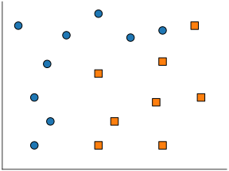{width=100%}
::::
:::: {.column width="50%"}
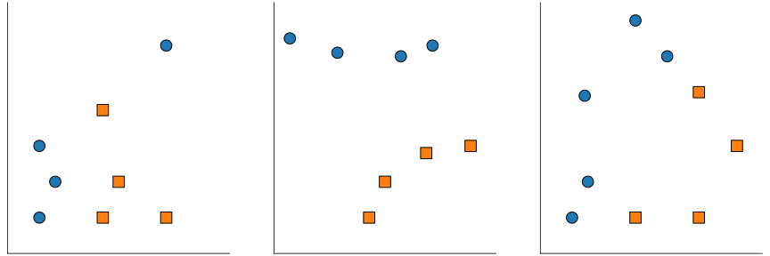{width=120%}
::::
::::

:::: {.notes}
Here we have a classification task: separating circles from squares.

**Bootstrapping**: This involves creating multiple variations of the original training set by taking random subsets of the data [02:11]. In practice, hundreds of these bootstrap samples are used [02:57].

**Aggregation**: Independent models (like decision trees) are trained on each bootstrap sample [03:15]. The final prediction is made by aggregating the individual results.
::::

## Bagging for classification

:::: {.columns}
:::: {.column width="50%"}
{width=100%}
::::
:::: {.column width="50%"}
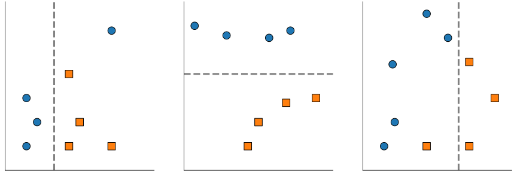{width=120%}

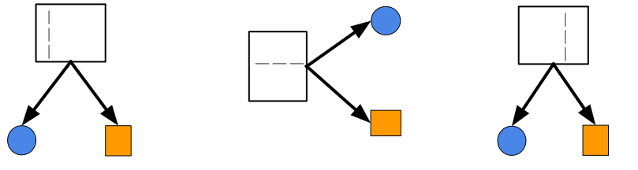{width=120%}
::::
::::

::: {.notes}
**Bootstrapping**: This involves creating multiple variations of the original training set by taking random subsets of the data [02:11]. In practice, hundreds of these bootstrap samples are used [02:57].

**Aggregation**: Independent models (like decision trees) are trained on each bootstrap sample [03:15]. The final prediction is made by aggregating the individual results.
:::

## Bagging for classification

:::: {.columns}
:::: {.column width="50%"}
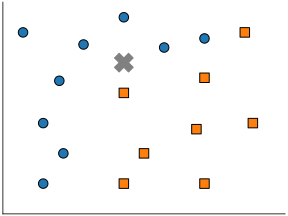{width=100%}
::::
:::: {.column width="50%"}
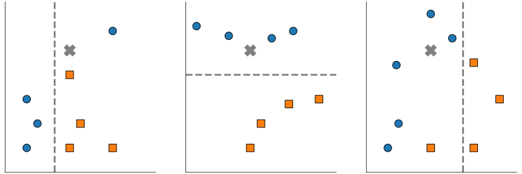{width=120%}

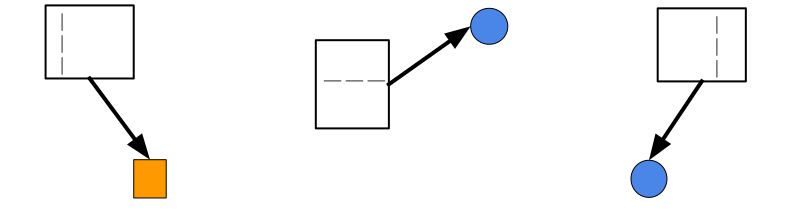{width=120%}

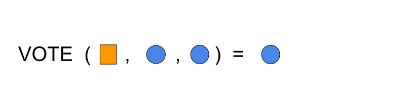{width=120%}
::::
::::

:::: {.center}
```python
from sklearn.ensemble import BaggingClassifier
from sklearn.ensemble import RandomForestClassifier
```
::::

:::: {.notes}
`BaggingClassifier`: This is a generic wrapper. You can pass it any algorithm—a Support Vector Machine, a Logistic Regression, or a Decision Tree. If you don't specify one, it defaults to a DecisionTreeClassifier.

`RandomForestClassifier`: This is a specific implementation of bagging that is hard-coded to use Decision Trees. It is highly optimized for this specific use case.
::::

## Bagging for classification

:::: {.columns}
:::: {.column width="50%"}
{width=100%}
::::
:::: {.column width="50%"}
{width=120%}

{width=120%}
::::
::::

:::: {.center}
```python
from sklearn.ensemble import BaggingClassifier
from sklearn.ensemble import RandomForestClassifier
```
::::

## Bagging for regression

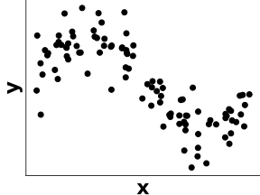{width=50%}

## Bagging for regression

:::: {.columns}
:::: {.column width="50%"}
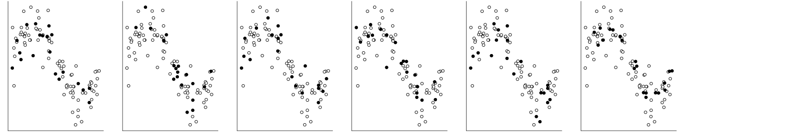{width=120%}
::::
:::: {.column width="50%"}

- Select multiple random subsets of the data

::::
::::

## Bagging for regression

:::: {.columns}
:::: {.column width="50%"}
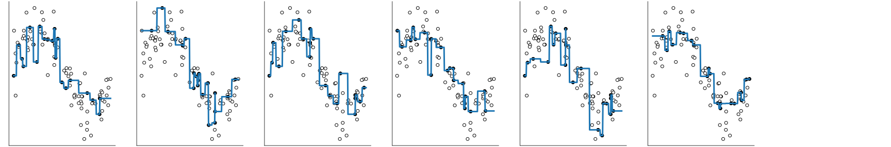{width=120%}
::::
:::: {.column width="50%"}

- Select multiple random subsets of the data  
- Fit one model on each

::::
::::

## Bagging for regression

:::: {.columns}
:::: {.column width="50%"}
{width=120%}

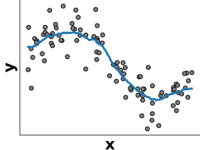{width=70%}
::::
:::: {.column width="50%"}

- Select multiple random subsets of the data  
- Fit one model on each  
- Average predictions

::::
::::

:::: {.notes}
In bagging, we construct deep trees independently of one another.  
Each tree is fitted on a subsample from the initial data, i.e. we only consider a random part of the data to build each model.  
When we have to classify a new point, we aggregate the predictions of all models in the ensemble with a voting scheme.  
Each deep tree overfits, but voting makes it possible to cancel out some of the training set noise. The ensemble overfits less than the individual models.
::::

## Bagging versus Random Forests

**Bagging** is a general strategy:

- Can work with any base model (linear, trees, ...)

**Random Forests** are bagged *randomized* decision trees:

- At each split: a random subset of features is selected  
- The best split is taken among the restricted subset  
- Extra randomization decorrelates the prediction errors  
- Uncorrelated errors make bagging work better

:::: {.notes}

Random forests are using randomization on both axes of the data matrix:

- by bootstrapping samples for each tree in the forest;
- randomly selecting a subset of features at each node of the tree.

It's fine to use deep trees (`max_depth=None`) in random forests because of the
reduced overfitting effect of prediction averaging.  
The more trees the better; it is typical to use 100 trees or more.  
There are diminishing returns when increasing the number of trees.  
More trees mean longer to fit, slower to predict, and larger models to deploy.
::::

## Take away

**Bagging** and **random forests** fit trees **independently**:

- each **deep tree overfits** individually  
- averaging the tree predictions **reduces overfitting**

