## Ensemble of tree-based models {.titlepage}

### Part 2: boosting and gradient boosting

::: {.notes}
In this lesson we look at a second strategy to build ensembles of tree-based models:
boosting and its practical variant, gradient boosting.
We will reuse the same classification and regression examples as for bagging to
highlight the conceptual differences between the two families.
:::

## Boosting for classification

::::: {.columns}
::::: {.column width="50%"}
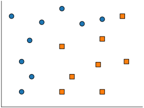{width=100%}
:::::
::::: {.column width="50%"}
:::::
:::::

::: {.notes}
We start from the same 2D classification problem as in the bagging lesson:
points in the plane are described by two input features,
and the task is to separate the blue class from the orange class.
Boosting will build an ensemble of trees on this *full* training set,
but unlike bagging, models are fitted sequentially, not independently.
:::

## Boosting for classification

::::: {.columns}
::::: {.column width="50%"}
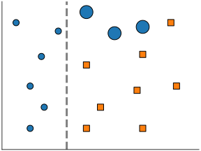{width=100%}
:::::
::::: {.column width="50%"}
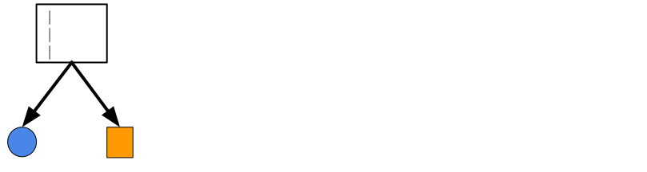{width=100%}
:::::
:::::

:::: {.notes}
A first shallow tree starts to separate circles from squares.
Mistakes (shown as bigger shape) done by this first tree model shall be corrected
by a second tree model.
::::

## Boosting for classification

::::: {.columns}
::::: {.column width="50%"}
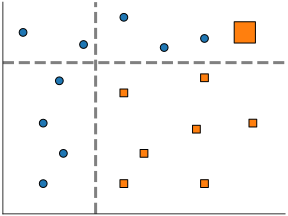{width=100%}
:::::
::::: {.column width="50%"}
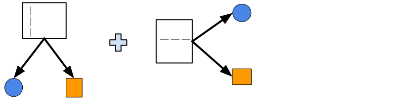{width=100%}
:::::
:::::

:::: {.notes}
So now, the second tree refines the first tree.
The final model is a weighted sum of these two trees.
::::

## Boosting for classification

::::: {.columns}
::::: {.column width="50%"}
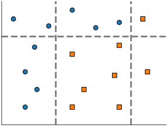{width=100%}
:::::
::::: {.column width="50%"}
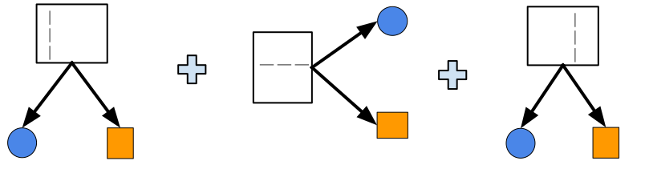{width=100%}
:::::
:::::

:::: {.notes}
Ensembling via boosting makes it possible to progressively refine the
predictions of the previous model.

At each step we focus on mistakes of the previous model to correct them.

Even if the first models are underfitting (shallow trees), adding more trees
makes it possible to perfectly classify all the training set data points.
::::

## Boosting for regression

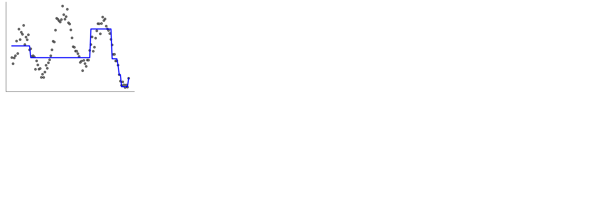{width=95%}

::: {.notes}
Here we illustrate boosting for regression.
We fit a first shallow regression tree that is intentionally constrained
(few splits), so it underfits and makes noticeable errors even on the training set.
Those large residuals are what the subsequent stages in the ensemble
will try to correct.
:::

## Boosting for regression

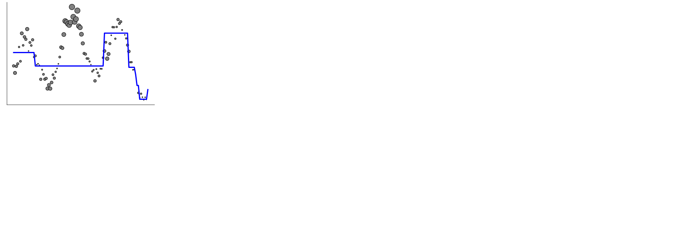{width=95%}

::: {.notes}
We reweight the training samples to give more importance
to points that are far from the current prediction function
and less importance to points that are already well predicted.
This reweighted dataset is what the next tree will see.
:::

## Boosting for regression

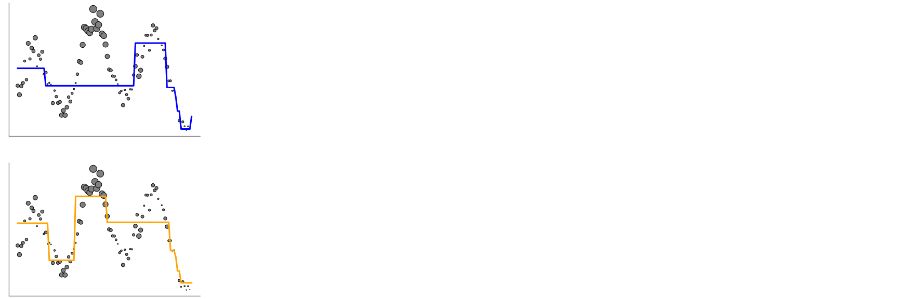{width=95%}

::: {.notes}
The second-stage tree (in orange) focuses its capacity on those highly
weighted, badly predicted samples from the first model.
We then combine the predictions of the first and second trees
to form a new ensemble prediction function.
:::

## Boosting for regression

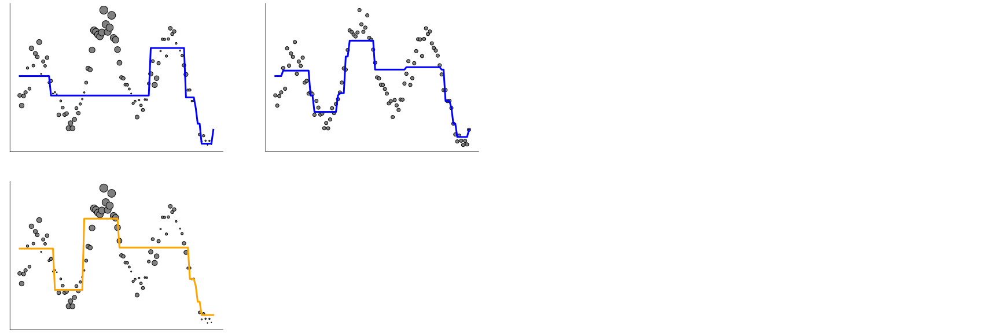{width=95%}

::: {.notes}
After combining the first two trees, we again look at the residual errors
of the ensemble and reweight the data:
points where the ensemble is still wrong get higher weight.
This prepares the training set for the third-stage model.
:::

## Boosting for regression

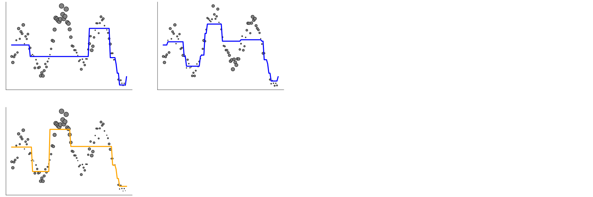{width=95%}

::: {.notes}
The new weights emphasize regions where the ensemble still underfits,
so the next tree will primarily target those remaining errors.
Iterating this procedure gradually reduces the underfitting.
:::

## Boosting for regression

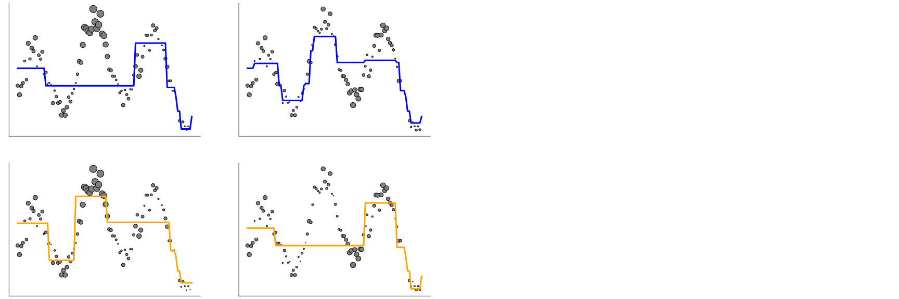{width=95%}

::: {.notes}
We train another shallow tree that focuses on the newly emphasized
prediction errors and add it to the ensemble.
With each additional stage, the ensemble prediction becomes
closer to the true regression function.
:::

## Boosting for regression

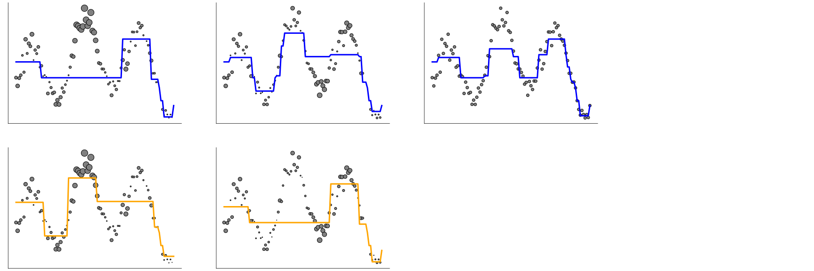{width=95%}

::: {.notes}
As we keep adding weak learners, the ensemble fits the signal better
while each individual tree remains simple and underfitting on its own.
This is the opposite philosophy of bagging, where each tree is deep and overfits.
:::

## Boosting for regression

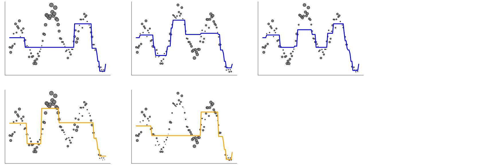{width=95%}

::: {.notes}
This view emphasizes how the ensemble corrects the errors of the previous
stages step by step.
Boosting with reweighting in this way is the idea behind the AdaBoost
classifier and regressor in scikit-learn.
Any base model that supports a `sample_weight` parameter can in principle
be used inside an AdaBoost ensemble.
:::

## Boosting for regression

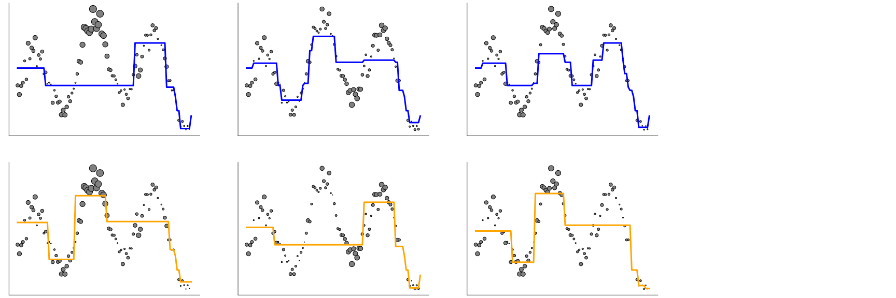{width=95%}

::: {.notes}
In practice, AdaBoost is mainly interesting as a simple way to introduce
the concept of boosting.
Nowadays, for tree-based ensembles, we more commonly use gradient boosting
and especially its faster histogram-based implementation.
:::

## Boosting for regression

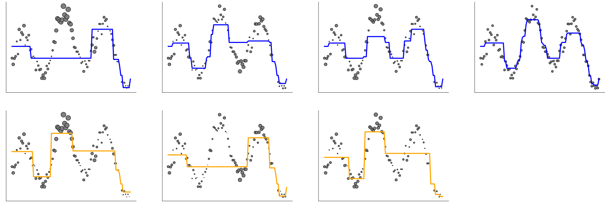{width=95%}

::: {.notes}
With enough boosting stages, the ensemble can achieve very small training
error: each new weak learner is added to reduce the remaining residuals.
However, one must still monitor for overfitting on a validation set
when deciding how many stages to use.
:::

## Boosting vs Gradient Boosting

. . .

**Traditional Boosting** (`sklearn.ensemble.AdaBoostClassifier`)
- Mispredicted **samples are re-weighted** at each step
- Can use any base model that accepts `sample_weight`

. . .

**Gradient Boosting** (`sklearn.ensemble.HistGradientBoostingClassifier`)
- Each base model predicts the **negative error** of previous models
- `sklearn` use decision trees as the base model

. . .

In practice, gradient boosting is more flexible thanks to the use of cost
functions and tend to exhibits better predictive performance than traditional
boosting.

:::: {.notes}
Even if AdaBoost and GBDT are both boosting algorithms, they are different in nature:

- AdaBoost assigns weights to specific samples,
- whereas GBDT fits successive decision trees on the residual errors (hence the name “gradient”) of their preceding tree.

Therefore, each new tree in the ensemble tries to refine its predictions by specifically addressing the errors made by the previous learner, instead of predicting the target directly.
::::

## Gradient Boosting and binned features

- `sklearn.ensemble.GradientBoostingClassifier`
  - Implementation of the traditional (exact) method
  - Fine for small data sets
  - Too slow for `n_samples` > 10,000

--

- `sklearn.ensemble.HistGradientBoostingClassifier`
  - Discretize numerical features (256 levels)
  - Efficient multi core implementation
  - **Much, much faster** when `n_samples` is large

:::: {.notes}
Like traditional decision trees `GradientBoostingClassifier` and
`GradientBoostingRegressor` internally rely on sorting the features values
which has an `n * log(n)` time complexity and is therefore not suitable for
large training set.

`HistGradientBoostingClassifier` and `HistGradientBoostingRegressor` use
histograms to approximate feature sorting to find the best feature split
thresholds and can therefore be trained efficiently on datasets with hundreds
of features and tens of millions of data points.

Furthermore they can benefit from running on machines with many CPU cores very
efficiently.
::::

## Visual: Bagging vs Boosting

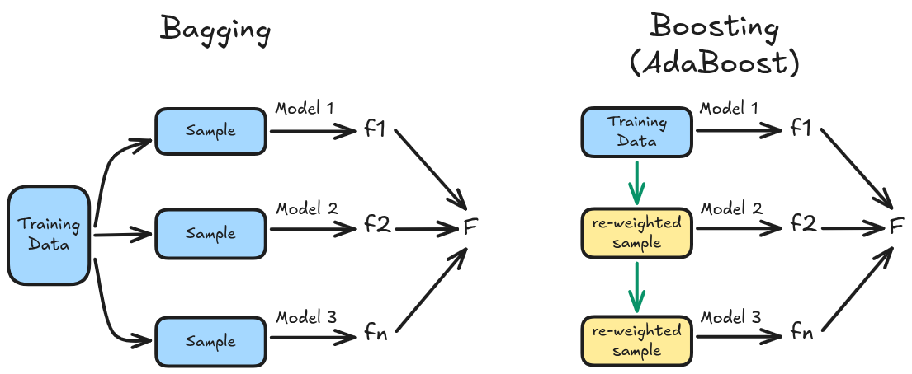{fig-align="center"}  

::: {.notes}
Bagging and random forests fit deep trees independently on bootstrap
subsamples of the training set: each tree overfits but averaging reduces
overfitting.

Boosting fits shallow trees sequentially: each stage focuses
on the errors of the previous ensemble, progressively reducing underfitting.

In practice, gradient boosting often yields slightly better accuracy than
random forests and predicts faster because the individual trees are shallow,
which matters when deploying models at scale.
:::

## Take away

**Bagging**  | **Boosting**
------------ | -------------
fit trees **independently** | fit trees **sequentially**
each **deep tree overfits** | each **shallow tree underfits**
averaging the tree predictions **reduces overfitting** | sequentially adding trees **reduces underfitting**

`Hist Gradient Boosting` > `Gradient Boosting` > `Ada Boost` > `RandomForest` > `Bagging`

::: {.notes}
Bagging and random forests fit deep trees independently on bootstrap
subsamples of the training set: each tree overfits but averaging reduces
overfitting.

Boosting fits shallow trees sequentially: each stage focuses
on the errors of the previous ensemble, progressively reducing underfitting.

In practice, gradient boosting often yields slightly better accuracy than
random forests and predicts faster because the individual trees are shallow,
which matters when deploying models at scale.
:::

